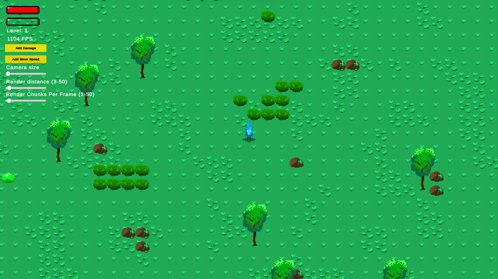
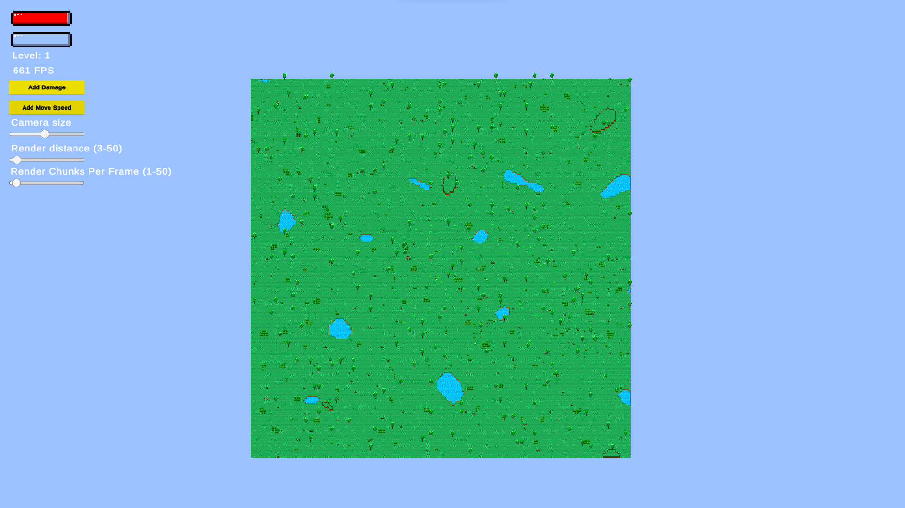
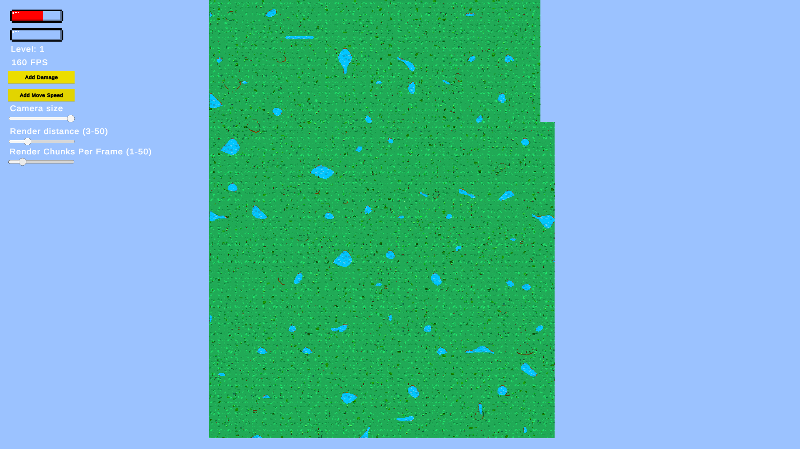
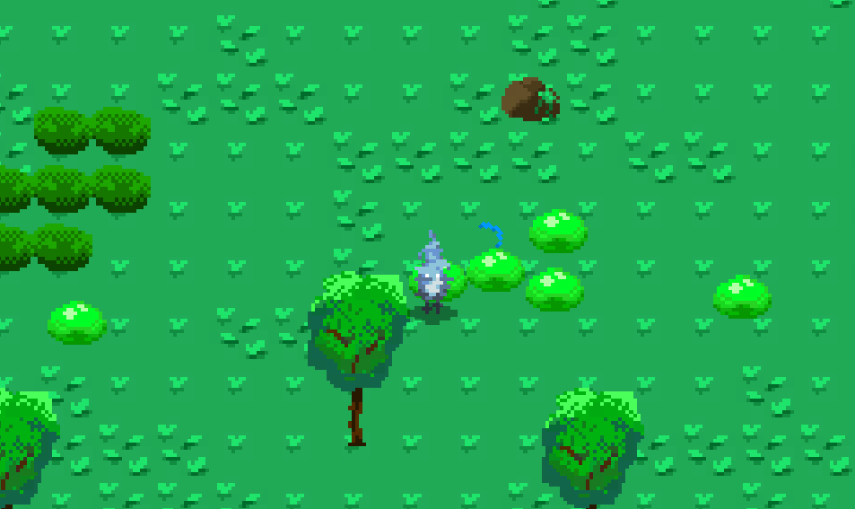

# A prototype of an infinite 2D world made with Unity
## About
This is a prototype where I experimented with infinite worlds and chunk-loading in Unity. The chunk-loading and infinite system was designed and built by mostly by me and uses threading to improve performance. The game also has collision, damage, levels, hp and such. I also built a simple enemy spawning and despawning systems. They also target the player if he gets too close and start to follow him.

### Download the latest build of the game
[Latest Game Build](https://raw.githubusercontent.com/NicoHeinola/InfiniteWorldGame/main/Builds/latest_build.rar)

### What can be done in the game?
- You can modify chunk loading properties from the top left sliders
- You can move with the character (WASD)
- You can attack enemies (LEFT MOUSE BUTTON) to gain experience which gives levels
    - You can upgrade your character with levels

## Images

Chunk loading example 1

Chunk loading example 2

Player can take damage and attack enemies
